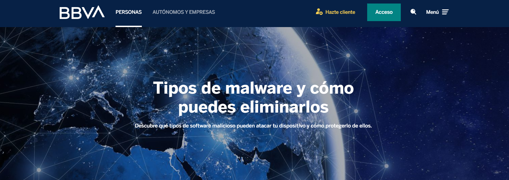

[Ciberseguridad &nbsp;&nbsp;&nbsp;>](https://www.bbva.es/finanzas-vistazo/ciberseguridad.html) &nbsp;&nbsp;&nbsp; [Ataques informáticos  &nbsp;&nbsp;&nbsp; >](https://www.bbva.es/finanzas-vistazo/ciberseguridad/ataques-informaticos.html) &nbsp;&nbsp;&nbsp;Tipos de malware y cómo puedes eliminarlos

&nbsp;

```
Indice                                                                                      __
______________________________________________________________________________________________

 - ¿Cuáles son los principales objetivos que persiguen estos programas maliciosos?

 - ¿Cómo puedes proteger tu dispositivo del malware?

 - Seguro BBVA Allianz Cyber
```

###### *02/11/2021*

Un *malware* es todo **programa o código malicioso que ataca un dispositivo electrónico**, desde ordenadores a móviles o tabletas, con el objetivo de **dañar su sistema**, provocar un **mal funcionamiento del mismo** o **robar la información** alojada en él. Puede venir oculto en:

1. **Archivos adjuntos** en correos electrónicos fraudulentos.
1. **Enlaces en SMS** que solicitan descargar aplicaciones o archivos.
1. **Aplicaciones no oficiales** que han sido infectadas con este software.
1. **Publicidad maliciosa** enmascarada en páginas web ilegítimas.
1. **Actualizaciones de software solicitadas** para ver ciertos contenidos en páginas web.

En caso de que el dispositivo electrónico se vea infectado con un *malware*, pueden detectarse **ciertas anomalías**, tales como:

* El dispositivo **no funciona con la fluidez** habitual.
* El sistema **se bloquea** con frecuencia.
* Se **reduce el espacio disponible en el disco duro.**
* Se **instalan programas desconocidos** para el usuario.
* Aparecen **extensiones y herramientas** en el navegador **que no se han descargado previamente.**
* **Cambia la página de inicio** del mismo.
* Se reciben **mensajes de error** desconocidos con asiduidad. 
* **Deja de funcionar correctamente** el antivirus.

&nbsp;


&nbsp;

## &nbsp;&nbsp;¿Cuáles son los principales objetivos que persiguen estos programas maliciosos?
&nbsp;

* **Robo de información:** son muchos los tipos de malware que tienen como objetivo conseguir información personal del usuario (contraseñas, cuentas bancarias o medios de pago) para venderla o utilizarla posteriormente, con el fin de cometer fraude o extorsión. Entre ellos se encuentran:

 * **_Troyano_:** se presenta como un programa útil para el usuario, por lo que habitualmente lo descarga e instala sin miedo. Una vez en el sistema, ofrece acceso remoto y no autorizado al hacker al dispositivo ya infectado.
  * **_Spyware_:** software espía que se instala en el equipo del usuario cuando descarga un fichero adjunto infectado o instala algún programa que contiene este software camuflado. Recopila información privada de los usuarios y la envía a terceros.
 * **_Keylogger_:** es una aplicación que registra las teclas que pulsa el usuario en su equipo, sin su permiso ni conocimiento, y después envía la información a terceros.

* **Secuestro de información (_ransomware_)**: es un tipo de malware que bloquea el acceso a la información almacenada en el equipo del usuario, cifrándola. Tras ello, los delincuentes solicitan el pago de un importe para que el usuario pueda recuperar dicha información. El miedo a perderla hace que las víctimas paguen este rescate, con resultados muy diversos, por lo que es totalmente desaconsejable ceder ante este tipo de extorsiones.

* **Fines publicitarios**: menos peligroso, pero muy molesto, es el denominado malware publicitario o _adware_, un software que muestra anuncios no deseados en la pantalla del usuario, habitualmente a través de su navegador o de su cuenta de correo. También lo hace mediante ventanas emergentes o _pop-ups_.

&nbsp;
## ¿Cómo puedes proteger tu dispositivo del malware?
&nbsp;

Los hábitos de seguridad más importantes que debes poner en práctica para evitar la descarga y ejecución de un software malicioso en tus dispositivos son:

* Mantener siempre **actualizados el software y las aplicaciones** de los dispositivos.
* **Descargar las aplicaciones exclusivamente desde los mercados oficiales**: Google Play o App Store.
* Utilizar **herramientas para detectar páginas web infectadas** como, por ejemplo, _Safe Browsing_ de Google. 
* **Instalar programas antivirus y antimalware** y mantenerlos siempre actualizados y en funcionamiento.
* **No descargar archivos de páginas que no sean seguras** (recuerda que las páginas web legítimas comienzan por https) ni de correos electrónicos que resulten sospechosos.
* No proporcionar tu información privada ni descargar programas en páginas web a las que has accedido a través de un enlace incluido en un correo electrónico. Antes de llevar a cabo una acción, debes cerciorarte siempre de que se trata de un email legítimo.

&nbsp;

## Seguro BBVA Allianz Cyber
&nbsp;

BBVA ayuda a sus clientes pymes y autónomos a proteger sus negocios de las ciberamenazas existentes en la red con herramientas como el seguro **[BBVA Allianz Cyber](https://www.bbva.es/empresas/productos/seguros/ciberseguro-proteccion-frente-a-ciberataques.html).**

El seguro proporciona coberturas preventivas para incrementar la seguridad de la información de la empresa, así como asistencia legal, informática y de peritos informáticos en caso de pérdida o robo de datos y coberturas de daños propios como la pérdida de beneficios por paralización del negocio.  Además, presta el apoyo y asesoramiento de un equipo de especialistas en caso de reclamaciones por violación de datos, perjuicios por actos en medios o sanciones de protección de datos.

##

# [BBVA]()  

**[Aviso legal](https://www.bbva.es/general/aviso-legal.html)**&nbsp; &nbsp; **[Cookies](https://www.bbva.es/general/cookies.html)**&nbsp; &nbsp; **[Datos personales](https://www.bbva.es/general/tratamiento-datos.html)**&nbsp; &nbsp; **[Informes legales](https://www.bbva.es/general/informes-legales.html)**&nbsp; &nbsp; **[Servicios de pago](https://www.bbva.es/general/estadisticas.html)**&nbsp; &nbsp; **[Tarifas](https://www.bbva.es/general/tarifas.html)**
 
**[Tablón de anuncios](https://www.bbva.es/general/tablon-anuncios.html)** &nbsp; **[Negocio responsable](https://www.bbva.es/general/negocio-responsable.html)**


###### Banco Bilbao Vizcaya Argentaria S.A. 2022

&nbsp;